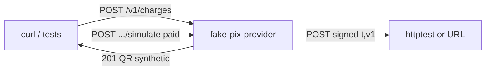

# fake-pix-provider

Synthetic PIX PSP in Go. This process **is** the provider: it creates a fake
EMV charge and, on `simulate`, POSTs the canonical AcmePay webhook
(`provider=fake_pix`) with Stripe-style `t=<unix>,v1=<hex>` HMAC.

It is **not** the partner API (`POST /v1/payments`). Callers invent `payment_id`
(the UUID AcmePay expects on `POST /v1/webhooks/payment`). Stdlib only;
in-memory store — restart drops all charges.

Fictional portfolio project. No real PSP.

## Architecture



| Route | Effect |
|-------|--------|
| `GET /health` | Liveness |
| `POST /v1/charges` | Create `PENDING` charge + fake EMV QR |
| `GET /v1/charges/{id}` | Detail (`last_delivery_status` after simulate) |
| `POST /v1/charges/{id}/simulate` | `paid` / `expired` / `failed` → async signed webhook |

HMAC is identical to AcmePay / `checkout-portal-next/lib/webhook-signature.ts`:
`HMAC-SHA256("${t}.${raw_body}", WEBHOOK_SECRET)` → header
`X-AcmePay-Signature: t=<unix>,v1=<hex>`. Shared secret default:
`dev-webhook-secret`.

## Quickstart

Go 1.23+. No extra services.

```bash
export WEBHOOK_SECRET=dev-webhook-secret
export FAKE_PIX_API_KEY=fake-pix-demo   # optional; unset = open routes
export PORT=8080
go run ./cmd/provider
```

Create a charge (point `callback_url` at anything that accepts POST — tests use
`httptest`; a local AcmePay webhook URL works the same):

```bash
curl -s -X POST http://localhost:8080/v1/charges \
  -H "Authorization: Bearer fake-pix-demo" \
  -H "Content-Type: application/json" \
  -d '{
    "amount": 1500,
    "currency": "BRL",
    "payment_id": "550e8400-e29b-41d4-a716-446655440000",
    "callback_url": "http://127.0.0.1:9999/v1/webhooks/payment"
  }'
```

Simulate payment (async **202**; a second simulate returns **200**
`already_simulated` and does not POST again):

```bash
curl -s -X POST http://localhost:8080/v1/charges/<id>/simulate \
  -H "Authorization: Bearer fake-pix-demo" \
  -H "Content-Type: application/json" \
  -d '{"type":"payment.paid"}'
```

Inbound auth also accepts `X-Api-Key: fake-pix-demo`. Amounts are integer minor
units (`1500` = R$ 15,00). Never floats.

## Quality gates

```bash
go test ./...
test -z "$(gofmt -l .)"
```

## Docs

See [AGENTS.md](AGENTS.md) for the module map and agent workflow.
Phase spec: [Docs/specs/fase-1-charges-webhooks.md](Docs/specs/fase-1-charges-webhooks.md).
ADR: [Docs/adrs/001-stdlib-and-in-memory.md](Docs/adrs/001-stdlib-and-in-memory.md).
